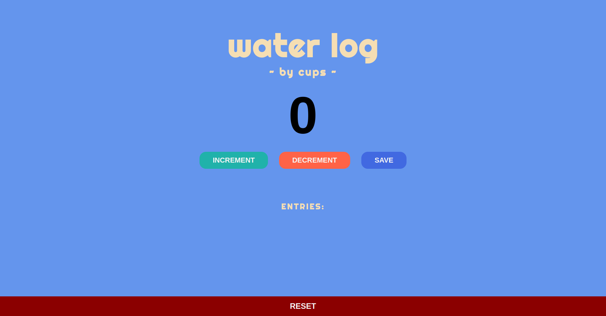

# Scrimba JavaScript Counter App

This is the first project from [Scrimba's Learn JavaScript course](https://v2.scrimba.com/learn-javascript-c0v). It's a simple counter app built with vanilla JavaScript, and some HTML & CSS. It mainly focus on making functions, adding event listeners to buttons and displaying text content.

Apart from the proposed, I added a water log theme to the project, with custom colors and fonts. I also added decrement and reset buttons.

